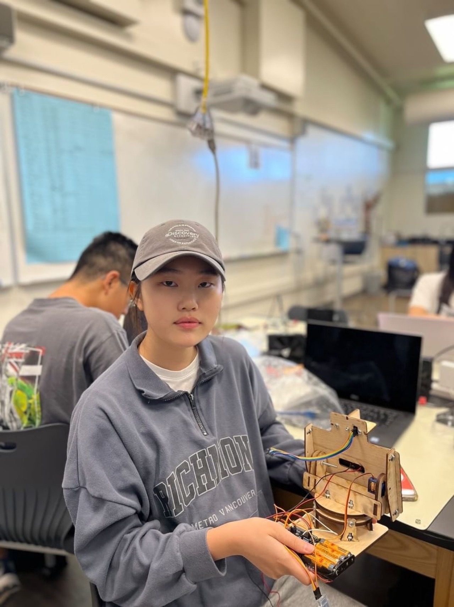
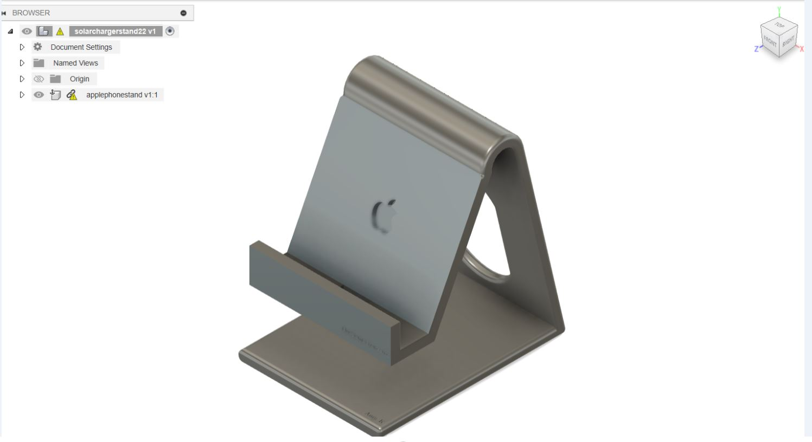
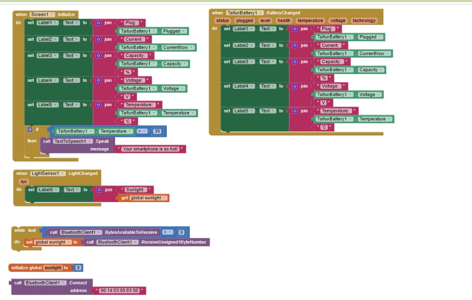
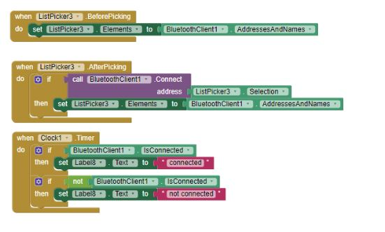
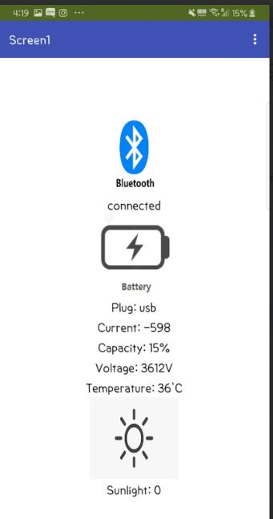
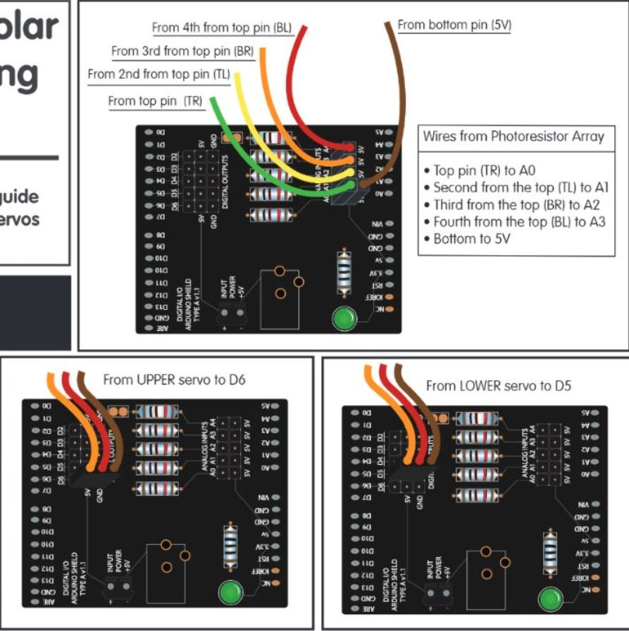
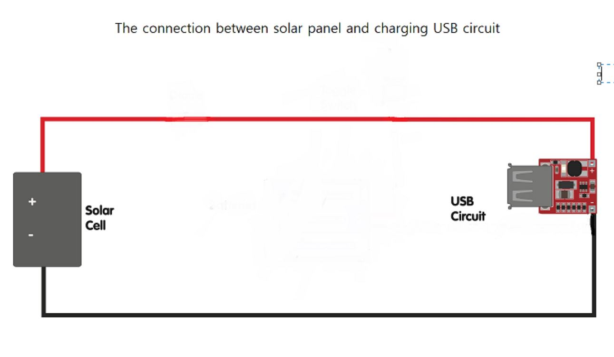

# Solar Tracker
It is the tracker which detects where the sun light shines so that it can convert from the solar energy to eletric energy. It have the function to charge it, so you can charge the smartphone battery only using the solar energy. Also, you can check the other information about the environment such as the temperature or humidity things. 

<!---This description should draw the reader in and make them interested in what you've built. You can include what the biggest challenges, takeaways, and triumphs from completing the project were.-->


|Name| School name| **Area of Interest** | Grade |
|:--:|:--:|:--:|:--:|
| Amy(Seoyeon) K | Valley Christian High School | Chemical,Mechanical Engineering | Rising Junior

<!---**Replace the BlueStamp logo below with an image of yourself and your completed project. Follow the guide [here](https://tomcam.github.io/least-github-pages/adding-images-github-pages-site.html) if you need help.** -->



# Modification
For modification, I added smartphone stand to make easier to charge the device using the solar power from the solar panel. For the smartphone stand, there is a hole on the bottom and the back of it so that the charging usb circuit and wires can be inserted and it looks clean. Also, I can see the value of sunlight, the chart of the sunlight for a whole day, and smartphone charging status to make sure the smartphone is charged using the solar power on the smartphone. I made my own app using the mit app inventor by coding. 

Phone stand



The code of app to check the phone charging


The code of app to  connect bluetooth to the solar tracker with smartphone




# Final Milestone
<iframe width="560" height="315" src="https://www.youtube.com/embed/F-98sx0Hl4M?si=xLZvhWE17DNHBbtE" title="YouTube video player" frameborder="0" allow="accelerometer; autoplay; clipboard-write; encrypted-media; gyroscope; picture-in-picture; web-share" referrerpolicy="strict-origin-when-cross-origin" allowfullscreen></iframe>

The goal for the final milestone is to make the solar tracker available to charge phone. My project is basically tracking sunshine and converting solar power to electrical power. After 4 of the sensors on the top left, top right, bottom left, and bottom right are detecting the sunshine. Whenever they detect the sunshine, the value of numbers they measured are used for calculating and the computer decided which servo should be moving which direction according to the code. When the solar tracker is facing the sun, the solar power from the solar panel is converted to electrical energy so that I can charge an device using the charging usb circuit connected to the wire on the solar panel. 
The challenge in this milestone was weak connection between usb circuit and solar panel. Even though I soldered in the right way, the multimeter is saying that is wrong. The problem was the little amount of lead between negative and positive terminal on the usb circuit. Because of that, I replaced it with new one and add pin to make sure the connection strong. 
-->


# Second Milestone

<iframe width="560" height="315" src="https://www.youtube.com/embed/wntJOIwsdMw?si=buplrxJSqPQrK0lx" title="YouTube video player" frameborder="0" allow="accelerometer; autoplay; clipboard-write; encrypted-media; gyroscope; picture-in-picture; web-share" referrerpolicy="strict-origin-when-cross-origin" allowfullscreen></iframe>

The goal for my second milestone is to solve the issue for the servo. Two of the servos which are on top and the bottom were not working at all. When I get rid of the arduino and connect the servos on the shield, they were working well. However, the sensors are working well on the arduino but not shield so I cannot even use the breadboard to connect them togehter. By using the electrical tester, I tried to find out which connection is weak, and the batteries were the problem so I replaced them with new big one to give bigger power to shield. After that, servo on the top was working well according to the code but the other one is not woring well. It is rotating in the wrong way. It seems to be reading the code for the top servo. The fundamental issue was in the arduino and the battery. Their ground were different, which make the arduino confusing. That's why servos read the code wrongly. 


# First Milestone
<iframe width="560" height="315" src="https://www.youtube.com/embed/JpZ5UY8uZ1I?si=ufLPYo7IaSHPRlNB" title="YouTube video player" frameborder="0" allow="accelerometer; autoplay; clipboard-write; encrypted-media; gyroscope; picture-in-picture; web-share" referrerpolicy="strict-origin-when-cross-origin" allowfullscreen></iframe>

The goal in my first milestone is to finish assembling the solar tracker and adapt the code to control the solar tracker. 4 of the LDR sensors which are top right, top left, bottom right, and bottom left detect the light. On the code, servo on the top and the other servo on the bottom move using the calculation of the value of 4 LDR sensors. For the vertical servo which is on the top, when the difference of the average top and average of bottom is over 50 which is tolerance on the code, it should be moving on the direction where the value is bigger among the average of top and average of bottom. For the horizontal servo which is on the bottom, it works in the same way as the vertical servo. There are many challenges and some of them are solved and unsolved. First of all, even though the code was compiled well, the servo is not moving at all and it made the wierd sound but I solved it by replacing it with the new one without any noisy sound. However, there is another problem with the servo again. The servo on the bottom doesn't have any problem but the servo on the top is moving to only one direction. It supposed to be moving to another direction depending on the value of LDR sensor. I treid to make servo anlge LimitHigh higher from 120 to 180 and it moves in another direction but not fully. I tried the another statement to set the angle of the servo using "map()" so it rotates fully but it comes back again. I disassembled it to analyze the problem but the servo doesn't move at all while the value of servo anlge is printed on the Serial monitor. I still cannot figure out what's the problem. The last challenge is the value of tolerance changing sudeenly on the code. The tolerance value should be always 50 as the constant value but it's chaning suddenly.
I will fix the problem in the servo so that it can rotate depending on the sensor and combine the solar usb to the solar tracker to add the function to charge the phone after assembling the solar usb. Maybe it would require printed 3D design for solar tracker to hold the solar usb box by itself.


# Schematics 





# Code


```c++

#include <ServoTimer2.h>

// horizontal servo
ServoTimer2 horizontal;
int servoh = 90;

int servohLimitHigh = 180;
int servohLimitLow = 0;

ServoTimer2 vertical;
int servov = 90;

int servovLimitHigh = 110;
int servovLimitLow = 20;
// 4 of LDR pin setting
int ldrTR = A0; // LDR top right
int ldrTL = A1; // LDR top left
int ldrBR = A2; // LDR bottom right
int ldrBL = A3; // LDR bottom left

#include <AltSoftSerial.h>
AltSoftSerial mySerial (3,2); 

void setup() {
  Serial.begin(9600);
  // servo connections
  horizontal.attach(6);
  vertical.attach(5);
  // move servos
  horizontal.write(90);
  vertical.write(90);
  delay(3000);

mySerial.begin(9600); 
}


void loop() {

  int tr = analogRead(ldrTR); // top right
  int tl = analogRead(ldrTL); // top left
  int br = analogRead(ldrBR); // bottom right
  int bl = analogRead(ldrBL); // bottom left

  int dtime = 0; // change for debugging only
  int tol = 50;

  int avt = (tl + tr) / 2; // average value top
  int avb = (bl + br) / 2; // average value bottom
  int avl = (tl + bl) / 2; // average value left
  int avr = (tr + br) / 2; // average value right

  int dvert = avt - avb;  // check the difference of up and down
  int dhoriz = avl - avr; // check the difference of left and right


  // send data to the serial monitor if desired
  Serial.print(tl);
  Serial.print(" ");
  Serial.print(tr);
  Serial.print(" ");
  Serial.print(bl);
  Serial.print(" ");
  Serial.print(br);
  Serial.print("  ");
  Serial.print(avt);
  Serial.print(" ");
  Serial.print(avb);
  Serial.print(" ");
  Serial.print(avl);
  Serial.print(" ");
  Serial.print(avr);
  Serial.print("  ");
  Serial.print(dtime);
  Serial.print("   ");
  Serial.print(tol);
  Serial.print("  ");
  Serial.print(servov);
  Serial.print("   ");
  Serial.print(servoh);
  Serial.println(" ");


  // when the absolute value of difference of vertical is bigger than tolerance's
  if (abs(tol) < abs(dvert)){
    if (avt > avb) {
      servov = ++servov;
      if (servov > servovLimitHigh) {
        servov = servovLimitHigh;
      }
    }
    else if (avt < avb) {
      servov = --servov;
      if (servov < servovLimitLow) {
        servov = servovLimitLow;
      }
    }
    vertical.write(servov*8+750);
  }

  // when the absolute value of the difference of horizontall is bigger than tolerance's.
  if (abs(tol) < abs(dhoriz)); {
    if (avl > avr) {
      servoh = --servoh;
      if (servoh < servohLimitLow) {
        servoh = servohLimitLow;
      }
    }
    else if (avl < avr) {
      servoh = ++servoh;
      if (servoh > servohLimitHigh) {
        servoh = servohLimitHigh;
      }
    }
    else if (avl == avr) {
      // nothing
    }
    horizontal.write(servoh*8+750);
  }
  
delay(dtime);
  
int maxValue =0;
if ( (tr> tl) && (tr> br) && (tr> bl) ){
  maxValue=tr;
}

if ( (tl > tr) && (tl > br) && (tl > bl)  ){
  maxValue=tl;
}


if ( (br > bl) && (br > tr) && (br > tl) ) {
 maxValue = br;
}

if( (bl > br) && (bl > tr) && (bl > tl) ){
  maxValue = bl;
}


mySerial.println(maxValue);
}

```

# Bill of Materials

| **Part** | **Note** | **Price** | **Link** |
|:--:|:--:|:--:|:--:|
|Dual Axis Tracker 3.0 Kit |Solar Tracker|$150| <a href= "https://www.browndoggadgets.com/products/dual-axis-smart-solar-tracker"> Solar tracker</a> | 
|Charging usb circuit|The part of the Solar Usb Charger 2.0 kit|$40|<a href= "https://www.browndoggadgets.com/products/solar-usb-kit-"> solar usb </a>|
|Charging usb circuit(you can choose to buy the solar usb charger kit or just just only usb circuit)|3V to 5V 1A USB Charger for Phone DC-DC Converter Step Up Boost Module|$4.77|<a href= "https://www.ebay.com/itm/296490056840?_trkparms=amclksrc%3DITM%26aid%3D1110018%26algo%3DHOMESPLICE.COMPLISTINGS%26ao%3D1%26asc%3D266916%2C267607%26meid%3Dccc369c2d5cb45eb8d66be30cd4dc0d1%26pid%3D101196%26rk%3D4%26rkt%3D12%26sd%3D404845034338%26itm%3D296490056840%26pmt%3D1%26noa%3D0%26pg%3D2332490%26algv%3DCompVIDesktopATF2V6%26brand%3DUnbranded&_trksid=p2332490.c101196.m2219&itmprp=cksum%3A296490056840ccc369c2d5cb45eb8d66be30cd4dc0d1%7Cenc%3AAQAJAAAA8GAdA8t7FtElKI2ebmtGeyFMNX7PfMWQov7CwR6Fgp%252FM1xanPTAI8JxipoMPIZxnO5wGD92r9cVYj759QOIqhE4lmd3aacHYJx8y0Gl1%252F9%252FdmNojC0FX68qlkjUX2LFpZSgkNMEt9%252F3V%252BBeimsGITNeh%252FYngyRyQ4P9XibXV0s4UmFxjT8xq%252FGWbwVj1kIVHsPOkFde5jgbqFER4x2fWdp6qtuz12RRKh9UVsBW6ov5mUWdgNY9Vi0UBVmeaZ4Ha2hE25zw2Ag1H58hubvuUGNtnORzYC3Xz76oKR50zSGG1ONFjZZhcllCTa%252FofYRO6IA%253D%253D%7Campid%3APL_CLK%7Cclp%3A2332490&itmmeta=01J18W9XMRGY69HNFFDGGETMBY">Charging usb circuit</a>|

# Resources

* https://learn.browndoggadgets.com/Guide/Dual+Axis+Solar+Tracker+3.0/382?lang=en
          instruction for solar tracker kit
  
* https://www.instructables.com/Dual-Axis-Tracker-V20/
   more information and explanation about solar tracker
* https://learn.browndoggadgets.com/Guide/Solar+USB+Charger+2.0/6?lang=en
  instruction for solar usb box kit
* https://www.instructables.com/Solar-USB-Charger-20-21/
  more information and explanation about solar solar usb charger box kit
* https://www.youtube.com/watch?v=C6vZFio-rkw&t=475s
   solar usb instruction video
* https://www.hackster.io/FIELDING/solar-panel-sun-tracker-phone-charger-f669ce
   the idea for combining usb charger circuit and solar tracker
* https://www.youtube.com/watch?v=EhuqmgimrDo&list=PLj5NnUk28LOclSJcF-SjmyoTu2e8qCgIt&index=4
  app inventor for bluetooth of LDR sensor reading on phone
* https://chargehq.net/kb/solar-tracking-settings
  app inventor for blutooth connecting smartphone and arduino
* https://projecthub.arduino.cc/ashraf_minhaj/how-to-use-servotimer2-library-simple-explain-servo-sweep-9bbe4e
  how to use servotimer2
* https://projecthub.arduino.cc/ashraf_minhaj/how-to-use-servotimer2-library-simple-explain-servo-sweep-9bbe4e
  AltoSerial


# Starter Project: Arduino Beginner
 <iframe width="560" height="315" src="https://www.youtube.com/embed/LpYfZG2CoQc?si=6JxsjkRi9CZVnVa_" title="YouTube video player" frameborder="0" allow="accelerometer; autoplay; clipboard-write; encrypted-media; gyroscope; picture-in-picture; web-share" referrerpolicy="strict-origin-when-cross-origin" allowfullscreen></iframe>

  My starter project is the BlueStamp engineering arduino Beginner. It's necessary part for the robotics, which would be helpful to learn about circuit and coding through this project.
  I had problem for uploading the code I made. When I verify the code I made, it is compiled well but it's not uploaded. I did not use the resistor which should be always together with the LED. When trying to install the resistor with them, it should be 220 ohm but I could not find the resistor with that exactly same number, I replaced two of 110 ohm with 220 ohm one by twisting two of them to make it pretned to be one. Even though the circuit and codes are all correct, it was not working. I tried to figure it out by changing new arduino, new breadboard and disassembling the shield that I soldered. And finally we figure it out what was the probelm, which was the lack of power so we add the wire connect to voltage 5.

# Code
```c++
const int bt = 2; //button pin
const int led = 13; //LED pin
int Btst = 0; //the first button state before starting

void  setup(){
  pinMode(bt, INPUT);
  pinMode(led, OUTPUT);
}

void  loop(){
  btst = digitalRead(bt);
  if (btst == HIGH){
    digitalWrite(led, HIGH);
  } 
  else{
    digitalWrite(led,  LOW);
  }
}
```
# Bill of Materials

| **Part** | **Note** | **Price** | **Link** |
|:--:|:--:|:--:|:--:|
| Arduino Beginner kit|kit |$150| https://learn.adafruit.com/adafruit-proto-shield-arduino|


<!---To watch the BSE tutorial on how to create a portfolio, click here. -->

